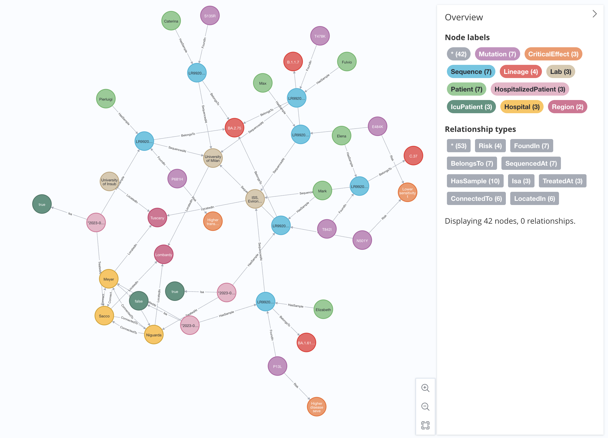

# PG-Triggers Testbed

[](https://opensource.org/licenses/MIT)

This GitHub repository contains the instructiona and the data needed to deploy a Neo4j demo in which are installed the four PG-Trigger presented in the related article . The repository wants demonstrates the feasibility of the proposal outlined in the "PG-Trigger" paper.

## Table of Contents

- [Introduction](#introduction)
- [Installation](#installation)
- [Usage](#usage)
- [Dataset](#dataset)
- [License](#license)

## Introduction

Neo4j is a powerful graph database that offers a flexible data model and advanced querying capabilities. It is widely used for modeling and analyzing complex relationships in various domains such as social networks, recommendation systems, and disease spreading models.

The APOC plugin (Awesome Procedures on Cypher) extends Neo4j's functionality by providing a collection of useful procedures and functions. It offers additional operations and utilities that are not available out of the box, making it easier to perform complex graph operations and data manipulations.

The "PG-Trigger" paper introduces a novel approach for handling triggers in graph databases. This repository serves as a proof of concept, showcasing the implementation of the proposed approach using Neo4j with the APOC plugin.

During our tests, the APOC plugin changed a few times thanks to the effort of the Neo4j community involved in the project. In the context of the apoc.trigger some procedures changed the syntax from version 4.1 to 5.9.0 In this testbed we refer to the APOC version 5.9.0 .

## Installation

To use the Neo4j Docker image with the APOC plugin, follow the instructions below:

1. Ensure that Docker is installed on your machine. You can download Docker from the official website: [https://www.docker.com/get-started](https://www.docker.com/get-started).
   
3. Create a local folder on your machine to store the files of this repository.

4. Download from the repository the "data" ZIP folder and unzip it inside the local directory previuosly created.

5. Open terminal and navigate to the directory containing the data files.

6. Run the Neo4j container with the APOC plugin using the following command:

   ```bash
   docker run --rm -p 7474:7474 -p 7687:7687 -v $PWD/data:/data --name pg_trigger_demo -e NEO4JLABS_PLUGINS='["apoc"]' -e   NEO4J_apoc_trigger_enabled=true -e NEO4J_AUTH=none neo4j
   ```
    
   This command starts the Neo4j container and exposes the default Neo4j ports (7474 for HTTP and 7687 for Bolt). The Neo4j server will already contain the APOC plugin, the dataset and the installed PG-Triggers. 

8. Access the Neo4j browser by opening http://localhost:7474 in your web browser. 

9. You are now ready to start exploring PG-Triggers!


## Dataset

The repository includes a dataset representing the schema of the COVID-19 spreading model presented in the "PG-Trigger" article as shown in the following image:



## Usage

Once the Neo4j container is up and running, you can interact with the database using the Neo4j browser or programmatically through Neo4j drivers.

To access the Neo4j browser, open [http://localhost:7474](http://localhost:7474) in your web browser. From there, you can execute Cypher queries, create nodes and relationships, and explore the graph database.

To programmatically interact with Neo4j, you can use any Neo4j driver compatible with the Neo4j version used in the Docker image. Configure the driver to connect to `localhost:7687` with the appropriate credentials.

In this Docker container, you will find three differetn PG-Triggers that acts upon changes in the dataset.

### WhoDesignationChange trigger

This trigger fires whenever the "whoDesignation" property of a Lineage node changes. As a results it creates a node of type Alert which in its properties describes the event and the timestamp in which the event happened. 

You can try out this trigger with the following query that set the "whoDesignation" property of the Lineage node 'B.1.1.7' from "Alpha" to "Delta":

```
MATCH (n:Lineage{lineage:'B.1.1.7'}) SET n.whoDesignation = 'Delta' RETURN * 
```

### IcuPatientIncrease trigger

The 'IcuPatientIncrease' trigger compares the patients who are in intensive care at the Sacco hospital after admission, and raises an alert when the new patients in ICU are more than 10\% of the total of patients in ICU; we assume that admissions are periodically registered by a transaction, e.g., daily.

The following query tests the functonality of this trigger by creating three new ICUPatient in the Sacco Hospital:

```
MATCH (h:Hospital{name: 'Sacco'})
MERGE (h)<-[:TreatedAt]-(ht2:HospitalizedPatient {prognosis: 'Recovery', admission: date('2023-06-29')})-[:Isa]->(:IcuPatient{admittedToIcu: true})
MERGE (h)<-[:TreatedAt]-(ht1:HospitalizedPatient {prognosis: 'Failure', admission: date('2023-06-29')})-[:Isa]->(:IcuPatient{admittedToIcu: true})
MERGE (h)<-[:TreatedAt]-(ht3:HospitalizedPatient {prognosis: 'Recovery', admission: date('2023-06-29')})-[:Isa]->(:IcuPatient{admittedToIcu: true})
RETURN *
```

### IcuPatientMove trigger

The next trigger describes the relocation of patients from the Sacco Hospital (in Lombardy) to the Meyer Hospital (in Tuscany), caused by the unavailability of ICU beds.

Since the Sacco Hospital has an total availability of 10 ICU beds, to test this trigger we need to make sure that we hava at least 10 ICUPatients in the Sacco Hospital.

The following query adds other 10 ICUPatients in the Sacco Hospital:

```
MATCH (h:Hospital{name: 'Sacco'})
MERGE (h)<-[:TreatedAt]-(ht2:HospitalizedPatient {prognosis: 'Recovery', admission: date('2023-06-29')})-[:Isa]->(:IcuPatient{admittedToIcu: true})
MERGE (h)<-[:TreatedAt]-(ht1:HospitalizedPatient {prognosis: 'Failure', admission: date('2023-06-29')})-[:Isa]->(:IcuPatient{admittedToIcu: true})
MERGE (h)<-[:TreatedAt]-(ht3:HospitalizedPatient {prognosis: 'Recovery', admission: date('2023-06-29')})-[:Isa]->(:IcuPatient{admittedToIcu: true})
MERGE (h)<-[:TreatedAt]-(ht4:HospitalizedPatient {prognosis: 'Failure', admission: date('2023-06-29')})-[:Isa]->(:IcuPatient{admittedToIcu: true})
MERGE (h)<-[:TreatedAt]-(ht5:HospitalizedPatient {prognosis: 'Failure', admission: date('2023-06-29')})-[:Isa]->(:IcuPatient{admittedToIcu: true})
MERGE (h)<-[:TreatedAt]-(ht6:HospitalizedPatient {prognosis: 'Recovery', admission: date('2023-06-29')})-[:Isa]->(:IcuPatient{admittedToIcu: true})
MERGE (h)<-[:TreatedAt]-(ht7:HospitalizedPatient {prognosis: 'Recovery', admission: date('2023-06-29')})-[:Isa]->(:IcuPatient{admittedToIcu: true})
MERGE (h)<-[:TreatedAt]-(ht8:HospitalizedPatient {prognosis: 'Failure', admission: date('2023-06-29')})-[:Isa]->(:IcuPatient{admittedToIcu: true})
MERGE (h)<-[:TreatedAt]-(ht9:HospitalizedPatient {prognosis: 'Failure', admission: date('2023-06-29')})-[:Isa]->(:IcuPatient{admittedToIcu: true})
MERGE (h)<-[:TreatedAt]-(ht10:HospitalizedPatient {prognosis: 'Recovery', admission: date('2023-06-29')})-[:Isa]->(:IcuPatient{admittedToIcu: true})
RETURN *
```

You will notice that they are going to be trasfered to the Meyer Hospital since they exceed the capacity of the Sacco Hospital.

### MoveToNearHospital trigger

This last trigger gives a different solution to the same problem, i.e., reacting to the unavailability of ICU beds in any Hospital in the Lombardy Region. It moves new admitted patients from those hospitals where ICU beds are exceeded, by finding the closest hospital where patients may be relocated.

To try out this trigger we can insert ICUPatient in the Meyer hospital by making sure the number exceeds the number specified in its 'IcuBeds' property. As the nearest hospital is the Niguards Hospital, the exceeding ICUPatients will be moved to this near hospital


## License

This project is licensed under the [MIT License](LICENSE). Feel free to use, modify, and distribute the code as per the terms of this license.
